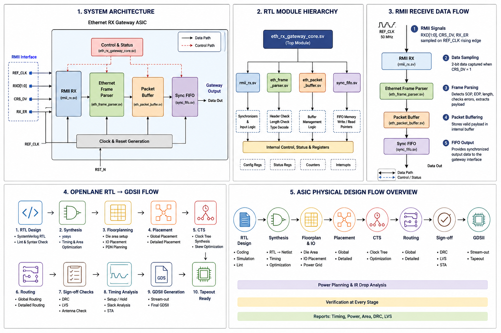

# Ethernet RX Gateway ASIC

<p align="center">


</p>

---

## 📖 Overview

The **Ethernet RX Gateway ASIC** is a modular **SystemVerilog-based ASIC design** that implements an Ethernet Receive (RX) Gateway capable of receiving Ethernet frames through an RMII interface, parsing packets, buffering payload data, and forwarding synchronized packets for further processing.

This project demonstrates a complete digital ASIC development workflow, beginning with RTL design and verification and progressing toward physical implementation using the **OpenLane RTL-to-GDSII flow** targeting the **SKY130 HD Process Design Kit (PDK)**.

The primary goal of this project is to develop a reusable and scalable Ethernet receive subsystem while gaining practical experience in modern ASIC design methodologies.

---

# 📑 Table of Contents

- Overview
- Project Objectives
- Key Features
- Tools & Technologies
- ASIC Design Flow
- Repository Structure
- System Architecture
- RTL Module Hierarchy
- RMII Receive Data Flow
- OpenLane RTL → GDSII Flow
- OpenLane Floorplan
- Module Description
- Verification Strategy
- Project Roadmap
- Documentation
- Future Enhancements
- License
- Author

---

# 🎯 Project Objectives

The objectives of this project include:

- Design a modular Ethernet RX Gateway using SystemVerilog.
- Implement an RMII-based Ethernet receiver.
- Parse Ethernet frames efficiently.
- Buffer incoming packets using FIFO memory.
- Create a reusable RTL architecture.
- Perform functional verification using self-checking testbenches.
- Prepare the design for ASIC implementation.
- Implement the design using OpenLane.
- Generate a manufacturable GDSII layout.
- Learn the complete RTL-to-GDSII ASIC design flow.

---

# ✨ Key Features

- RMII Ethernet Receiver
- Ethernet Frame Parser
- Packet Buffer
- Synchronization FIFO
- Modular RTL Architecture
- ASIC Ready RTL
- OpenLane Compatible Design
- SKY130 HD Technology
- Clean Module Hierarchy
- Scalable Design
- Industry-Oriented Documentation

---

# 🛠 Tools & Technologies

| Category | Tool |
|-----------|------|
| HDL | SystemVerilog |
| Simulation | Cadence Incisive |
| Synthesis | Yosys |
| Physical Design | OpenLane 2 |
| Physical Design Engine | OpenROAD |
| DRC | Magic |
| LVS | Netgen |
| Layout Viewer | KLayout |
| Timing Analysis | OpenROAD STA |
| PDK | SKY130 HD |
| Version Control | Git & GitHub |

---

# 🔄 Complete ASIC Design Flow

```text
System Specification
        │
        ▼
RTL Design
        │
        ▼
Functional Verification
        │
        ▼
Logic Synthesis
        │
        ▼
Floorplanning
        │
        ▼
Power Distribution Network
        │
        ▼
Placement
        │
        ▼
Clock Tree Synthesis
        │
        ▼
Routing
        │
        ▼
Static Timing Analysis
        │
        ▼
DRC Verification
        │
        ▼
LVS Verification
        │
        ▼
GDSII Generation
```

---

# 📁 Repository Structure

```text
ethernet-rx-gateway-asic/

├── docs/
│   ├── architecture.md
│   ├── rtl_design.md
│   ├── verification.md
│   └── images/
│       ├── project_overview.png
│       ├── architecture.png
│       ├── rtl_module_hierarchy.png
│       ├── rmii_receive_data_flow.png
│       ├── openlane_rtl_to_gdsii.png
│       ├── floorplan_openlane.png
│
├── rtl/
│
├── tb/
│
├── README.md
│
└── LICENSE
```

---

# 🖼 Project Overview

<p align="center">

</p>

---

# 🏗 System Architecture

<p align="center">

</p>

The Ethernet RX Gateway is composed of several reusable RTL modules:

- RMII Receiver
- Frame Parser
- Packet Buffer
- Synchronization FIFO
- Top-Level Gateway Controller

Each module is independently verified and integrated through a hierarchical top-level architecture.

---

# 📦 RTL Module Hierarchy

<p align="center">

</p>

The Ethernet RX Gateway follows a modular architecture where each block performs a dedicated function. This modularity simplifies verification, maintenance, and future enhancements.

| Module | Description |
|---------|-------------|
| `eth_rx_gateway_core` | Top-level module integrating all RX components |
| `rmii_rx` | Receives serial Ethernet data from the RMII interface |
| `eth_frame_parser` | Decodes Ethernet frame headers and extracts payload |
| `eth_packet_buffer` | Buffers received packets before forwarding |
| `sync_fifo` | Synchronizes data between different processing stages |

---

# 📡 RMII Receive Data Flow

<p align="center">

</p>

The receive path follows the sequence below:

```text
RMII Interface
      │
      ▼
RMII Receiver
      │
      ▼
Frame Parser
      │
      ▼
Packet Buffer
      │
      ▼
Synchronization FIFO
      │
      ▼
Gateway Output
```

### Receive Flow

1. Ethernet frames arrive through the RMII interface.
2. The RMII receiver reconstructs incoming bytes.
3. The frame parser validates and extracts packet information.
4. Packet data is temporarily stored in the packet buffer.
5. The synchronization FIFO safely transfers data to downstream logic.
6. The processed packet is forwarded to the gateway interface.

---

# ⚙️ OpenLane RTL → GDSII Flow

<p align="center">

</p>

The OpenLane flow converts the verified RTL into a manufacturable ASIC layout.

The implementation stages include:

- RTL Synthesis
- Floorplanning
- Power Distribution Network (PDN)
- Standard Cell Placement
- Clock Tree Synthesis (CTS)
- Global Routing
- Detailed Routing
- Static Timing Analysis (STA)
- Design Rule Check (DRC)
- Layout Versus Schematic (LVS)
- Final GDSII Generation

---

# 🏗️ OpenLane Floorplan

<p align="center">

</p>

The figure above illustrates the floorplanning stage of the physical implementation. During floorplanning, the die boundary, core region, standard-cell rows, and routing resources are organized before placement begins.

> **Note:** The floorplan image is included to illustrate the planned physical design flow. Actual implementation metrics and reports will be updated as the OpenLane flow progresses.

---

# 🧩 Module Descriptions

## 1. RMII Receiver

**Purpose**

Receives serial Ethernet data through the RMII interface and reconstructs bytes for higher-level processing.

**Responsibilities**

- RMII signal sampling
- Byte reconstruction
- Data synchronization
- Frame reception

---

## 2. Ethernet Frame Parser

**Purpose**

Interprets Ethernet frame fields and extracts packet information.

**Responsibilities**

- Header decoding
- Destination MAC extraction
- Source MAC extraction
- EtherType identification
- Payload extraction

---

## 3. Packet Buffer

**Purpose**

Temporarily stores received packet data before forwarding.

**Responsibilities**

- Packet buffering
- Write control
- Read control
- Overflow protection

---

## 4. Synchronization FIFO

**Purpose**

Provides reliable clock-domain synchronization and data buffering.

**Responsibilities**

- FIFO storage
- Full/Empty detection
- Safe data transfer
- Flow control

---

## 5. Ethernet RX Gateway Core

**Purpose**

Top-level module responsible for coordinating all receive-path operations.

**Responsibilities**

- Module integration
- Data flow management
- Packet forwarding
- Control signal generation

---

# ✅ Verification Strategy

The RTL is verified using a self-checking SystemVerilog testbench.

The verification process includes:

- Functional simulation
- Directed test cases
- Packet reception testing
- Buffer validation
- FIFO verification
- Output correctness checking

The simulation environment is designed to ensure correct functionality before synthesis and physical implementation.

---

# 📊 Current Project Status

| Stage | Status |
|--------|--------|
| RTL Design | ✅ Completed |
| Module Integration | ✅ Completed |
| Functional Verification | ✅ In Progress |
| Documentation | ✅ Completed |
| OpenLane Preparation | ✅ Completed |
| RTL Synthesis | ⏳ Planned |
| Physical Design | ⏳ Planned |
| Timing Analysis | ⏳ Planned |
| DRC/LVS | ⏳ Planned |
| GDSII Generation | ⏳ Planned |

---

# 🚀 Project Roadmap

The following roadmap outlines the planned milestones for the Ethernet RX Gateway ASIC.

| Milestone | Status |
|-----------|:------:|
| Project Planning | ✅ |
| System Architecture | ✅ |
| RTL Design | ✅ |
| RTL Documentation | ✅ |
| Testbench Development | ✅ |
| Functional Verification | 🔄 In Progress |
| RTL Synthesis | ⏳ Planned |
| Floorplanning | ⏳ Planned |
| Power Planning | ⏳ Planned |
| Placement | ⏳ Planned |
| Clock Tree Synthesis | ⏳ Planned |
| Global Routing | ⏳ Planned |
| Detailed Routing | ⏳ Planned |
| Static Timing Analysis | ⏳ Planned |
| DRC Verification | ⏳ Planned |
| LVS Verification | ⏳ Planned |
| GDSII Generation | ⏳ Planned |

---

# 📚 Documentation

Detailed documentation for every stage of the project is available in the **docs/** directory.

| Document | Description |
|----------|-------------|
| **architecture.md** | Complete system architecture |
| **rtl_design.md** | RTL hierarchy and module descriptions |
| **verification.md** | Functional verification methodology |

---

# 💻 Development Environment

| Item | Details |
|------|---------|
| HDL | SystemVerilog |
| Simulator | Cadence Incisive / Xcelium |
| Synthesis | Yosys |
| Physical Design | OpenLane 2 |
| PDK | SKY130 HD |
| Layout Viewer | KLayout |
| DRC | Magic |
| LVS | Netgen |
| Timing Analysis | OpenROAD STA |
| Version Control | Git |
| Repository | GitHub |

---

# 📈 Future Enhancements

Future versions of the project may include:

- Gigabit Ethernet Support
- AXI-Stream Interface
- CRC Generator and Checker
- VLAN Packet Support
- DMA Engine
- Configurable Packet Filters
- Multiple RX Queues
- Power Optimization
- Area Optimization
- UVM-Based Verification Environment
- FPGA Prototype Validation
- ASIC Tape-Out Preparation

---

# 🤝 Contributing

Contributions are welcome.

If you would like to improve this project:

1. Fork the repository.
2. Create a feature branch.
3. Commit your changes.
4. Push your branch.
5. Open a Pull Request.

---

# 📄 License

This project is released under the **MIT License**.

Feel free to use this project for educational and research purposes.

---

# 👨‍💻 Author

**Hemanth N**

Bachelor of Engineering  
Electronics & Communication Engineering

**Mangalore Institute of Technology & Engineering (MITE)**

GitHub:

https://github.com/Hemanth-n-reddy

---

# 🌟 Acknowledgements

This project was developed to gain practical experience in:

- Digital ASIC Design
- RTL Design using SystemVerilog
- Functional Verification
- Open-Source ASIC Flow
- Physical Design using OpenLane
- SKY130 Process Design Kit
- Git & GitHub Collaboration

Special thanks to the open-source ASIC community for developing and maintaining tools such as **Yosys**, **OpenLane**, **OpenROAD**, **Magic**, **Netgen**, **KLayout**, and the **SKY130 PDK**, which make modern ASIC education and prototyping accessible.

---

# ⭐ Support

If you found this project useful:

⭐ Star this repository

🍴 Fork the repository

💡 Share feedback or suggestions through GitHub Issues

---

<p align="center">

### 🚀 From RTL to GDSII — Learning ASIC Design One Stage at a Time.

</p>
