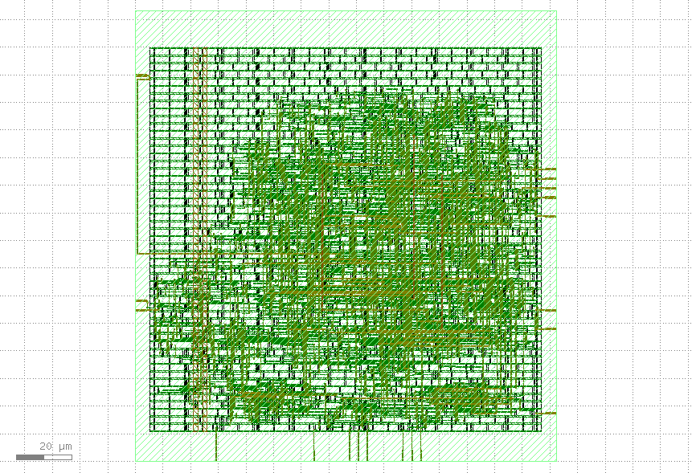

# Ethernet RX Gateway ASIC


An Ethernet Receive (RX) Gateway ASIC designed using **SystemVerilog** and implemented using the **OpenLane RTL-to-GDSII ASIC flow** targeting the **Sky130 HD Process Design Kit (PDK)**.

---

# 📖 Project Overview

The Ethernet RX Gateway ASIC is a modular hardware accelerator that receives Ethernet frames through the RMII interface, parses incoming packets, buffers payload data, and forwards synchronized packets to the gateway interface.

The project demonstrates a complete **ASIC Design Flow** from RTL design to GDSII generation using open-source EDA tools.

---

# 🖼️ Project Overview

<p align="center">
  
</p>

---

# ✨ Features

- RMII Ethernet Receiver
- Ethernet Frame Parser
- Packet Buffer
- Synchronization FIFO
- Modular SystemVerilog RTL
- ASIC Ready Design
- OpenLane RTL-to-GDSII Flow
- Sky130 HD Technology
- Timing Clean Implementation
- Open Source ASIC Toolchain

---

# 🛠️ Tools & Technologies

| Category | Tool |
|----------|------|
| RTL Design | SystemVerilog |
| Synthesis | Yosys |
| Physical Design | OpenLane 2 |
| Physical Design Engine | OpenROAD |
| Layout Viewer | KLayout |
| DRC/LVS | Magic, Netgen |
| Timing Analysis | OpenROAD STA |
| PDK | Sky130 HD |
| Version Control | Git & GitHub |

---

# 📊 Implementation Summary

| Parameter | Value |
|-----------|-------|
| RTL Language | SystemVerilog |
| Technology | Sky130 HD |
| Physical Design Flow | OpenLane 2 |
| Top Module | eth_rx_gateway_core |
| Standard Cells | 1072 |
| Cell Area | 10364.9 µm² |
| Total Power | 1.003 mW |
| Setup Violations | 0 |
| Hold Violations | 0 |
| GDSII Generated | ✅ |

---

# 🔄 ASIC Design Flow

```text
Specification
      │
      ▼
RTL Design
      │
      ▼
Functional Verification
      │
      ▼
Logic Synthesis
      │
      ▼
Floorplanning
      │
      ▼
Placement
      │
      ▼
Clock Tree Synthesis
      │
      ▼
Routing
      │
      ▼
Static Timing Analysis
      │
      ▼
DRC / LVS
      │
      ▼
GDSII Generation
```

---

# 📂 Repository Structure

```text
ethernet-rx-gateway-asic/
│
├── rtl/
│   ├── eth_rx_gateway_core.sv
│   ├── eth_rx_path.sv
│   ├── eth_packet_buffer.sv
│   ├── eth_frame_parser.sv
│   ├── rmii_rx.sv
│   └── sync_fifo.sv
│
├── openlane/
│
├── reports/
│
├── results/
│
├── simulations/
│
├── verification/
│
├── docs/
│   ├── architecture.md
│   ├── rtl_design.md
│   ├── verification.md
│   ├── openlane_flow.md
│   ├── results.md
│   ├── future_work.md
│   └── images/
│       ├── project_overview.png
│       ├── architecture.png
│       ├── rtl_module_hierarchy.png
│       ├── rmii_receive_data_flow.png
│       ├── openlane_rtl_to_gdsii.png
│       ├── asic_physical_design_flow.png
│       └── gds_layout.png
│
├── README.md
├── LICENSE
└── .gitignore
```

---

# 📸 Project Images

## System Architecture

<p align="center">

</p>

---

## RTL Module Hierarchy

<p align="center">

</p>

---

## RMII Receive Data Flow

<p align="center">

</p>

---

## OpenLane RTL → GDSII Flow

<p align="center">

</p>

---

## 🏗️ OpenLane Floorplan

The floorplan below shows the chip floorplan generated during the OpenLane physical design stage.

<p align="center">
  
</p>

### Floorplan Summary

| Parameter | Value |
|-----------|-------|
| Die Area | 1000 µm × 1000 µm |
| Core Area | 880 µm × 880 µm |
| Utilization | ~48% |
| Aspect Ratio | 1.00 |
| Core Margin | 60 µm |
| Row Height | 2.72 µm |

**Key Features**
- Square die layout (1000 µm × 1000 µm)
- Dedicated I/O pad ring
- Standard cell placement rows
- Power rails around the core
- Keepout margins for routing
- Tap and decap cells for power integrity## 🏗️ OpenLane Floorplan

The floorplan below shows the chip floorplan generated during the OpenLane physical design stage.

<p align="center">
  
</p>

### Floorplan Summary

| Parameter | Value |
|-----------|-------|
| Die Area | 1000 µm × 1000 µm |
| Core Area | 880 µm × 880 µm |
| Utilization | ~48% |
| Aspect Ratio | 1.00 |
| Core Margin | 60 µm |
| Row Height | 2.72 µm |

# 📊 Implementation Results

The Ethernet RX Gateway ASIC is implemented using the OpenLane RTL-to-GDSII flow targeting the SKY130 HD Process Design Kit.

## Results Summary

| Metric | Value |
|--------|------:|
| RTL Language | SystemVerilog |
| PDK | SKY130 HD |
| Flow | OpenLane 2 |
| Design Type | Ethernet RX Gateway |
| Target Frequency | 50 MHz |

## 📸 Physical Design Snapshots

### Floorplan

<p align="center">
  
</p>

### Placement
*Coming Soon*

### Clock Tree Synthesis (CTS)
*Coming Soon*

### Routing
*Coming Soon*

### Final GDSII Layout
*Coming Soon*

# 🚀 Project Roadmap

- [x] Project planning and architecture
- [x] RTL module design
- [x] Testbench development
- [x] Functional simulation
- [x] RTL module hierarchy documentation
- [x] RMII receive data flow documentation
- [x] OpenLane RTL → GDSII flow documentation
- [x] Floorplan documentation
- [ ] RTL synthesis using OpenLane
- [ ] Floorplanning using OpenLane
- [ ] Standard cell placement
- [ ] Clock Tree Synthesis (CTS)
- [ ] Global and detailed routing
- [ ] Static Timing Analysis (STA)
- [ ] DRC verification
- [ ] LVS verification
- [ ] Final GDSII generation

# 🛠️ Technologies Used

- **HDL:** SystemVerilog
- **Simulation:** Cadence Incisive (ncvlog / ncelab / ncsim)
- **ASIC Flow:** OpenLane
- **Physical Design:** OpenROAD
- **PDK:** SKY130 HD
- **Version Control:** Git & GitHub

**Key Features**
- Square die layout (1000 µm × 1000 µm)
- Dedicated I/O pad ring
- Standard cell placement rows
- Power rails around the core
- Keepout margins for routing
- Tap and decap cells for power integrity

## GDS Layout

<p align="center">

</p>

---

# 📚 Documentation

Detailed project documentation is available below.

| Document | Description |
|----------|-------------|
| [System Architecture](docs/architecture.md) | Complete system architecture and data flow |
| [RTL Design](docs/rtl_design.md) | RTL hierarchy and module descriptions |
| [Verification](docs/verification.md) | Functional verification methodology |
| [OpenLane Flow](docs/openlane_flow.md) | RTL-to-GDSII implementation flow |
| [Results](docs/results.md) | ASIC implementation metrics |
| [Future Work](docs/future_work.md) | Planned enhancements |

---

# 🚀 Future Improvements

- Gigabit Ethernet Support
- AXI-Stream Interface
- CRC Generation and Verification
- VLAN Support
- DMA Engine
- Area Optimization
- Power Optimization
- Multi-Clock Support
- UVM Verification Environment
- FPGA Prototype
- ASIC Tape-Out Preparation

---

# 📄 License

This project is licensed under the **MIT License**.

---

# 👨‍💻 Author

**Hemanth N**

Bachelor of Engineering (Electronics & Communication Engineering)

Mangalore Institute of Technology & Engineering (MITE)

GitHub:
https://github.com/Hemanth-n-reddy

---

## ⭐ Support

If you found this project helpful, please consider giving this repository a **Star ⭐**.
