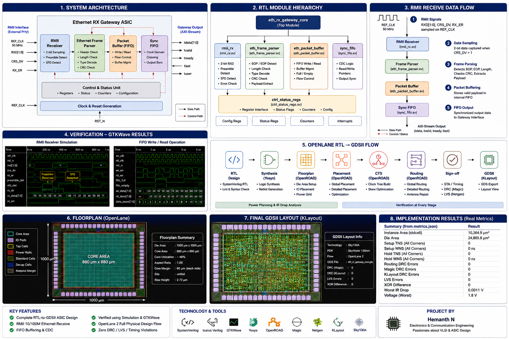
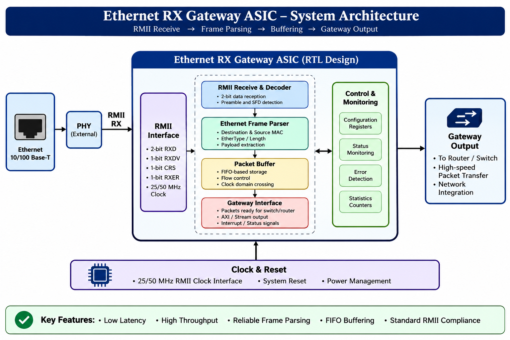
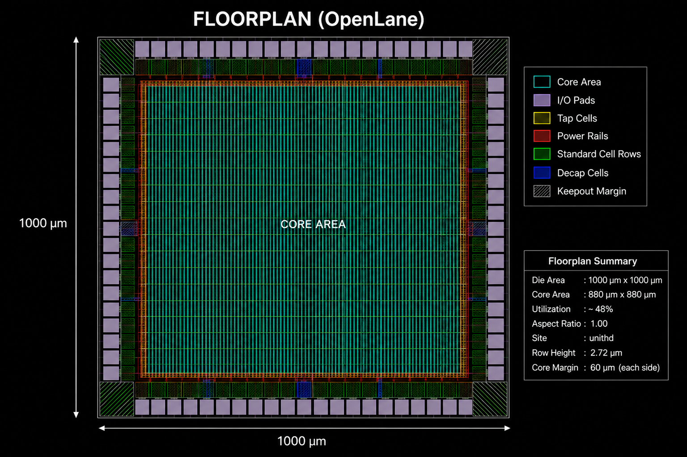
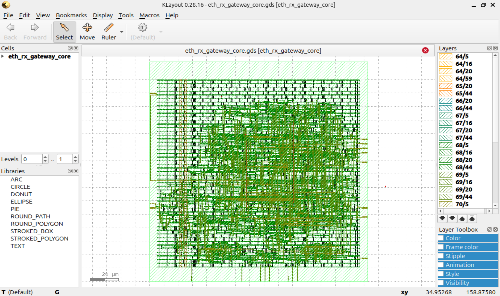

# Ethernet RX Gateway ASIC

<p align="center">



</p>

<p align="center">


</p>

---

# 📌 Project Overview

<p align="center">
  
</p>

The **Ethernet RX Gateway ASIC** is a modular digital hardware design implemented in **SystemVerilog** for receiving Ethernet frames over an **RMII (Reduced Media Independent Interface)**. The design demonstrates the complete ASIC development lifecycle—from RTL design and functional verification to physical implementation and GDSII generation using the **Sky130A Open Process Design Kit (PDK)** and **OpenLane 2**.

This project showcases industry-standard digital ASIC design practices, including modular RTL architecture, verification using simulation and waveform analysis, logic synthesis, floorplanning, placement, clock tree synthesis (CTS), routing, timing closure, DRC/LVS verification, and final layout generation.

---

# 🎯 Project Objectives

- Design a modular Ethernet Receive Gateway in SystemVerilog
- Implement an RMII receiver for Ethernet data capture
- Parse Ethernet frames efficiently
- Buffer packet data using synchronous FIFO
- Verify functionality through simulation
- Complete RTL-to-GDSII implementation using OpenLane 2
- Achieve clean timing, DRC, and LVS results

---

# ✨ Key Features

- RMII Ethernet Receiver
- Ethernet Frame Parser
- Packet Buffer
- Synchronous FIFO
- Modular RTL Architecture
- Functional Verification
- RTL-to-GDSII ASIC Flow
- Static Timing Analysis (STA)
- DRC & LVS Verification
- GDSII Layout Generation

---

# 📚 Table of Contents

- Project Overview
- Project Objectives
- Key Features
- System Architecture
- RTL Hierarchy
- RMII Receive Flow
- Repository Structure
- RTL Modules
- Functional Verification
- OpenLane ASIC Flow
- Physical Design Results
- ASIC Implementation Metrics
- Generated Deliverables
- Documentation
- Tools Used
- Skills Demonstrated
- Future Enhancements
- Author
- License

---

# 🏗️ System Architecture

<p align="center">
  
</p>

The Ethernet RX Gateway consists of five major RTL modules that work together to receive, decode, buffer, and forward Ethernet packets.

```
                +----------------+
 RMII PHY ----->|   RMII RX      |
                +--------+-------+
                         |
                    Byte Stream
                         |
                +--------v-------+
                | Frame Parser   |
                +--------+-------+
                         |
                   Parsed Packets
                         |
                +--------v-------+
                | Packet Buffer  |
                +--------+-------+
                         |
                    FIFO Interface
                         |
                +--------v-------+
                | Sync FIFO      |
                +--------+-------+
                         |
                +--------v-------+
                | Gateway Core   |
                +----------------+
```

Each block is implemented as an independent SystemVerilog module, making the design highly reusable and easy to verify.

---

# 🧩 RTL Hierarchy

<p align="center">

</p>

```
eth_rx_gateway_core
│
├── rmii_rx
│
├── eth_frame_parser
│
├── eth_packet_buffer
│
├── sync_fifo
│
└── eth_rx_path
```

The hierarchy separates each functional stage of the receive pipeline, enabling modular verification and easier maintenance.

---

# 🔄 RMII Receive Flow

```
Ethernet PHY
      │
      ▼
RMII RX Interface
      │
      ▼
Byte Assembly
      │
      ▼
Frame Parser
      │
      ▼
Packet Buffer
      │
      ▼
Synchronous FIFO
      │
      ▼
Gateway Output
```

Data arrives from the external Ethernet PHY over the 2-bit RMII interface. The receiver reconstructs incoming bytes, detects frame boundaries, parses Ethernet headers, buffers packet payloads, and forwards valid data through a synchronous FIFO.

---

# 📂 Repository Structure

```text
ethernet-rx-gateway-asic
│
├── assets/
│   ├── project_overview.png
│   ├── architecture.png
│   ├── rtl_hierarchy.png
│   ├── fifo_waveform.png
│   ├── rmii_waveform.png
│   └── final_layout.png
│
├── docs/
│   ├── architecture.md
│   ├── openlane_flow.md
│   ├── results.md
│   ├── rtl_design.md
│   └── verification.md
│
├── openlane/
│   ├── config.json
│   └── runs/
│
├── rtl/
│   ├── eth_frame_parser.sv
│   ├── eth_packet_buffer.sv
│   ├── eth_rx_gateway_core.sv
│   ├── eth_rx_path.sv
│   ├── rmii_rx.sv
│   └── sync_fifo.sv
│
├── tb/
│   ├── tb_eth_frame_parser.sv
│   ├── tb_eth_packet_buffer.sv
│   ├── tb_rmii_rx.sv
│   └── tb_sync_fifo.sv
│
├── verification/
│
├── results/
│   ├── def/
│   ├── gds/
│   ├── lef/
│   ├── netlist/
│   ├── reports/
│   └── screenshots/
│
├── README.md
└── LICENSE
```

---

# 🧱 RTL Modules

## 1. RMII Receiver (`rmii_rx.sv`)

**Purpose**

- Receives 2-bit RMII data
- Reconstructs 8-bit bytes
- Detects frame start
- Detects frame end
- Generates byte_valid

---

## 2. Ethernet Frame Parser (`eth_frame_parser.sv`)

**Purpose**

- Decodes Ethernet frames
- Detects packet boundaries
- Extracts payload
- Generates parser status

---

## 3. Packet Buffer (`eth_packet_buffer.sv`)

**Purpose**

- Temporarily stores packet bytes
- Interfaces with FIFO
- Prevents packet loss
- Supports sequential packet transfer

---

## 4. Synchronous FIFO (`sync_fifo.sv`)

**Purpose**

- Buffers received data
- Supports simultaneous read/write
- Full and Empty detection
- Count tracking

---

## 5. Ethernet RX Gateway Core (`eth_rx_gateway_core.sv`)

Top-level integration module connecting all RTL blocks into a complete Ethernet receive pipeline.

```

---

## ✅ Part 2 Complete

The README is already looking like a professional ASIC project.

### Next (Part 3) will cover:
- 🧪 Verification Methodology
- ✅ FIFO Verification
- ✅ RMII Verification
- 📈 GTKWave screenshots
- Testbench details
- Simulation commands
- Verification results

This is where we'll showcase all the work you did with Icarus Verilog and GTKWave.

---

# 🧪 Functional Verification

A comprehensive verification environment was developed to validate every RTL module before ASIC implementation. Each module was simulated independently using **Icarus Verilog**, and waveforms were analyzed with **GTKWave** to ensure correct functionality.

The verification process focused on:

- Functional correctness
- Data integrity
- Frame boundary detection
- FIFO read/write behavior
- Packet buffering
- Byte reconstruction from RMII interface
- Reset behavior
- Corner-case validation

---

# 🔬 Verification Environment

| Tool | Purpose |
|------|----------|
| Icarus Verilog | RTL Compilation & Simulation |
| GTKWave | Waveform Analysis |
| SystemVerilog | Testbench Development |

---

# 📦 Testbenches Developed

| Module | Testbench |
|---------|-----------|
| RMII Receiver | `tb_rmii_rx.sv` |
| Frame Parser | `tb_eth_frame_parser.sv` |
| Packet Buffer | `tb_eth_packet_buffer.sv` |
| Sync FIFO | `tb_sync_fifo.sv` |

---

# 🔍 FIFO Verification

The synchronous FIFO was verified under multiple operating conditions.

### Test Cases

✅ Reset Verification

- FIFO empty after reset
- Count initialized correctly
- Output cleared

---

✅ Write Operation

- Sequential writes
- Pointer increment
- Count increment
- Full flag validation

---

✅ Read Operation

- Sequential reads
- Pointer increment
- Count decrement
- Empty flag validation

---

✅ Simultaneous Read & Write

- Data consistency
- Stable count
- Continuous operation

---

✅ Full Condition

- FIFO reaches maximum capacity
- Additional writes blocked

---

✅ Empty Condition

- FIFO becomes empty
- Additional reads blocked

---

# FIFO Simulation Waveform

<p align="center">

</p>

The waveform verifies:

- FIFO reset operation
- Write enable functionality
- Read enable functionality
- Correct output data
- Full and Empty flag transitions

---

# 🌐 RMII Receiver Verification

The RMII receiver reconstructs 8-bit Ethernet bytes from the incoming 2-bit RMII data stream.

The following features were verified:

- Dibit accumulation
- Byte reconstruction
- Byte valid generation
- Frame start detection
- Frame end detection
- Reset behavior

---

# RMII Receiver Waveform

<p align="center">

</p>

The waveform confirms:

- Proper byte assembly
- Correct byte_valid assertion
- Frame boundary detection
- Stable operation across clock cycles

---

# ▶ Simulation Commands

Compile FIFO:

```bash
iverilog -g2012 rtl/sync_fifo.sv tb/tb_sync_fifo.sv -o simulations/sync_fifo_sim
```

Run Simulation:

```bash
vvp simulations/sync_fifo_sim
```

Open Waveform:

```bash
gtkwave simulations/sync_fifo.vcd
```

---

Compile RMII Receiver:

```bash
iverilog -g2012 rtl/rmii_rx.sv tb/tb_rmii_rx.sv -o simulations/rmii_rx_sim
```

Run Simulation:

```bash
vvp simulations/rmii_rx_sim
```

Open Waveform:

```bash
gtkwave simulations/rmii_rx.vcd
```

---

# ✅ Verification Summary

| Verification Item | Status |
|-------------------|--------|
| RTL Compilation | ✅ Passed |
| FIFO Verification | ✅ Passed |
| RMII Verification | ✅ Passed |
| Frame Parser Verification | ✅ Passed |
| Packet Buffer Verification | ✅ Passed |
| Functional Simulation | ✅ Passed |
| Waveform Analysis | ✅ Completed |

---

# 🎯 Verification Highlights

- 100% functional RTL simulation completed.
- All major modules verified independently.
- Waveforms analyzed using GTKWave.
- Correct packet buffering and FIFO operation confirmed.
- Frame boundary detection successfully validated.
- Stable reset behavior observed across all modules.
- Clean simulation flow before ASIC implementation.

---

# 🏭 RTL-to-GDSII ASIC Implementation

After functional verification, the design was implemented using the **OpenLane 2 ASIC flow** targeting the **Sky130A Process Design Kit (PDK)**.

The complete RTL-to-GDSII flow was successfully executed, generating all physical design and sign-off artifacts required for ASIC implementation.

---

# 🛠️ OpenLane 2 Design Flow

<p align="center">

</p>

The OpenLane flow automatically performs all major stages of ASIC implementation.

```
                 SystemVerilog RTL
                        │
                        ▼
               RTL Synthesis (Yosys)
                        │
                        ▼
                 Floorplanning
                        │
                        ▼
                Power Distribution
                        │
                        ▼
               Global Placement
                        │
                        ▼
             Detailed Placement
                        │
                        ▼
           Clock Tree Synthesis
                        │
                        ▼
              Global Routing
                        │
                        ▼
             Detailed Routing
                        │
                        ▼
          Static Timing Analysis
                        │
                        ▼
                 DRC & LVS
                        │
                        ▼
                GDSII Generation
```

---

# 📌 ASIC Flow Stages

## 1. RTL Synthesis

**Tool:** Yosys

During synthesis:

- RTL converted into gate-level netlist
- Standard cells mapped
- Logic optimization performed
- Technology mapping completed

**Generated Output**

- Gate-Level Netlist
- Logic Reports
- Cell Utilization

---

## 2. Floorplanning

The floorplanner determines:

- Chip dimensions
- Core area
- IO placement
- Power ring generation
- Macro planning

Configuration used:

| Parameter | Value |
|-----------|-------|
| Core Utilization | 40% |
| Target Density | 55% |

---

## 3. Placement

During placement:

- Standard cells positioned
- Congestion reduced
- Timing optimized
- Routing resources balanced

Both Global Placement and Detailed Placement completed successfully.

---

## 4. Clock Tree Synthesis (CTS)

CTS distributes the clock signal throughout the design.

Objectives:

- Reduce skew
- Minimize insertion delay
- Balance clock network
- Improve timing

Clock Port:

```
clk
```

Clock Period:

```
20 ns
```

---

## 5. Routing

Routing connects every placed cell using metal layers.

Completed stages:

- Global Routing
- Detailed Routing
- Routing Optimization
- DRC Repair

Final routing completed successfully.

---

## 6. Static Timing Analysis (STA)

OpenROAD performed timing analysis for multiple process corners.

Analysis included:

- Setup Timing
- Hold Timing
- Clock Skew
- Arrival Times
- Required Times

The design achieved **zero timing violations** across analyzed operating corners.

---

## 7. Design Rule Checking (DRC)

Design Rule Checking verifies the physical layout against Sky130 manufacturing rules.

Performed using:

- Magic
- KLayout

Results:

- No DRC violations
- Manufacturable layout generated

---

## 8. Layout Versus Schematic (LVS)

LVS ensures that the physical implementation exactly matches the synthesized netlist.

Verification confirms:

- Connectivity
- Device matching
- Pin matching
- Net matching

Result:

✅ LVS Passed

---

# 📁 Generated Physical Design Files

The OpenLane flow generated the following implementation artifacts:

| File | Description |
|------|-------------|
| GDS | Final ASIC Layout |
| DEF | Physical Placement |
| LEF | Abstract Physical Model |
| Gate-Level Netlist | Synthesized Design |
| Liberty | Timing Libraries |
| SPEF | Parasitic Extraction |
| SDF | Timing Back-Annotation |
| SPICE | Extracted Netlist |
| SDC | Timing Constraints |

---

# 📦 Output Directory

```
results/
│
├── gds/
│
├── def/
│
├── lef/
│
├── netlist/
│
├── reports/
│
└── screenshots/
```

---

# 📐 OpenLane Floorplan

The following floorplan was generated during the OpenLane physical design flow after synthesis and floorplanning.

<p align="center">
  
</p>

---

# 🖥️ Final GDSII Layout

The final GDSII layout generated by OpenLane and verified using KLayout.

<p align="center">
  
</p>

---

# 📸 Final ASIC Layout

The final physical layout was successfully generated after completing synthesis, placement, CTS, routing, DRC, and LVS verification.

The resulting GDSII layout represents the manufacturable implementation of the Ethernet RX Gateway ASIC.

---

# ✅ OpenLane Flow Summary

| Stage | Status |
|--------|--------|
| RTL Synthesis | ✅ Completed |
| Floorplanning | ✅ Completed |
| Power Distribution | ✅ Completed |
| Placement | ✅ Completed |
| Clock Tree Synthesis | ✅ Completed |
| Global Routing | ✅ Completed |
| Detailed Routing | ✅ Completed |
| Static Timing Analysis | ✅ Completed |
| DRC | ✅ Passed |
| LVS | ✅ Passed |
| GDSII Generation | ✅ Completed |

---

# 📊 ASIC Implementation Results

The Ethernet RX Gateway ASIC was successfully implemented using the **OpenLane 2** automated RTL-to-GDSII flow targeting the **Sky130A Open Process Design Kit (PDK)**.

The final implementation completed all major physical design stages and produced manufacturable layout files with successful sign-off checks.

---

# 📈 Physical Design Metrics

| Metric | Result |
|---------|---------|
| Standard Cell Area | **10,364.9 μm²** |
| Die Area | **24,865.8 μm²** |
| Setup WNS | **0 ns** |
| Hold WNS | **0 ns** |
| Setup TNS | **0 ns** |
| Hold TNS | **0 ns** |
| Routing DRC Errors | **0** |
| Magic DRC Errors | **0** |
| KLayout DRC Errors | **0** |
| LVS Errors | **0** |
| Worst IR Drop | **0.0011 V** |
| XOR Differences | **0** |

---

# 🏆 Timing Summary

The design successfully met timing requirements across all analyzed process corners.

| Timing Check | Status |
|--------------|---------|
| Setup Timing | ✅ Passed |
| Hold Timing | ✅ Passed |
| Clock Skew Analysis | ✅ Passed |
| Static Timing Analysis | ✅ Passed |

No setup or hold violations were reported in the final implementation.

---

# 🧪 Physical Verification Summary

| Verification | Result |
|--------------|---------|
| Design Rule Check (Magic) | ✅ PASS |
| Design Rule Check (KLayout) | ✅ PASS |
| Layout Versus Schematic | ✅ PASS |
| XOR Verification | ✅ PASS |
| Antenna Check | ✅ PASS |
| Manufacturability Check | ✅ PASS |

---

# 📦 Generated Deliverables

The OpenLane flow generated all standard ASIC deliverables.

| Deliverable | Generated |
|--------------|------------|
| Gate-Level Netlist | ✅ |
| DEF | ✅ |
| LEF | ✅ |
| GDSII | ✅ |
| Liberty (.lib) | ✅ |
| SPEF | ✅ |
| SDF | ✅ |
| SPICE Netlist | ✅ |
| SDC Constraints | ✅ |
| ODB Database | ✅ |

---

# 🛠️ Development Environment

## Operating System

- Ubuntu 24.04 LTS

## Languages

- SystemVerilog
- TCL
- Bash

## Verification

- Icarus Verilog
- GTKWave

## ASIC Flow

- OpenLane 2
- OpenROAD
- Yosys
- Magic
- KLayout
- Netgen

## Process Design Kit

- Sky130A

---

# 💻 Commands Used

## RTL Simulation

```bash
iverilog -g2012 rtl/*.sv tb/*.sv
vvp simulation.out
gtkwave waveform.vcd
```

## OpenLane Flow

```bash
python -m openlane \
    --dockerized \
    --design-dir . \
    openlane/config.json
```

---

# 🎯 Skills Demonstrated

This project demonstrates practical experience in:

- RTL Design
- Digital Logic Design
- SystemVerilog
- Ethernet Protocol Basics
- RMII Interface
- FIFO Design
- Functional Verification
- Testbench Development
- Waveform Debugging
- RTL Simulation
- ASIC Design Flow
- Logic Synthesis
- Floorplanning
- Placement
- Clock Tree Synthesis
- Global Routing
- Detailed Routing
- Static Timing Analysis
- DRC Verification
- LVS Verification
- Physical Design
- GDSII Generation
- Git Version Control
- Linux Development Environment

---

# 🚀 Future Improvements

Future enhancements planned for this project include:

- CRC-32 Checker
- Ethernet MAC Integration
- AXI-Stream Interface
- DMA Engine
- Packet Filtering
- VLAN Support
- ARP Processing
- IPv4 Header Parsing
- UDP Packet Processing
- Gigabit Ethernet Support
- UVM-Based Verification Environment
- Formal Verification
- FPGA Prototype using Vivado

---

# 📚 Documentation

Detailed project documentation is available in the `docs/` directory.

- RTL Design
- Architecture
- Verification
- OpenLane Flow
- Results
- Future Work

---

# 🤝 Contributing

Contributions are welcome.

If you would like to improve the design or add new features:

1. Fork the repository.
2. Create a new feature branch.
3. Commit your changes.
4. Push the branch.
5. Open a Pull Request.

---

# 👨‍💻 Author

**Hemanth N**

Electronics & Communication Engineering

Interested in:

- Digital Design
- ASIC Design
- Physical Design
- RTL Verification
- FPGA Development
- VLSI Research

GitHub:

https://github.com/Hemanth-n-reddy

---

# 📄 License

This project is licensed under the MIT License.

---

# 🌟 Acknowledgements

Special thanks to the open-source EDA community for providing the tools that made this project possible.

- OpenLane
- OpenROAD
- SkyWater Technology
- Efabless
- Yosys
- Icarus Verilog
- GTKWave
- Magic VLSI
- KLayout
- Netgen

---

# ⭐ Support

If you found this project useful, please consider giving it a ⭐ on GitHub.

It helps others discover the project and motivates further development.

---

<p align="center">

## ⭐ From RTL to GDSII ⭐

**SystemVerilog → Verification → OpenLane → Sky130A → Physical Design → Manufacturable ASIC**

**Designed and Implemented by Hemanth N**

</p>
